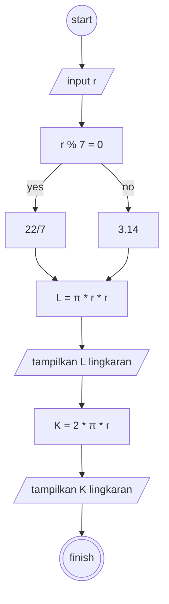

# flowchart hitung luas dan keliling lingkaran

```mermaid
    flowchart TB
    start((start))
    input[/input r/]
    desicion["r % 7 = 0"]
    pi["22/7"]
    pi2["3.14"]
    luas["L = π * r * r"]
    keliling["K = 2 * π * r"]
    output[/"tampilkan L lingkaran"/]
    output2[/"tampilkan K lingkaran"/]
    finish(((finish)))

    start --> input
    input --> desicion
    desicion --yes--> pi
    desicion -- no --> pi2
    pi & pi2 --> luas
    luas --> output
    output --> keliling
    keliling --> output2
    output2 --> finish
```
